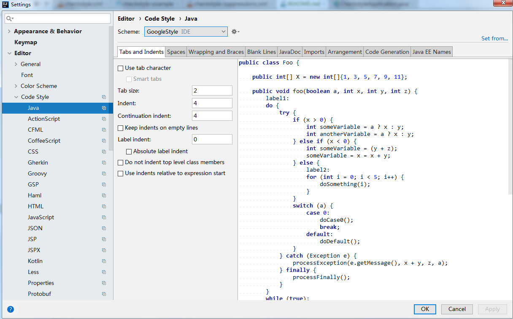

## Java Code Style

这个一个Java code style 样例，使用maven-checkstyle-plugin检查代码规范。

**Update on 2022/6/20**: Prefer `fmt-maven-plugin` & `spotless-maven-plugin`.

* fmt-maven-plugin:   
  check: `mvn clean com.spotify.fmt:fmt-maven-plugin:check`   
  format: `mvn clean com.spotify.fmt:fmt-maven-plugin:format` 
* spotless-maven-plugin:  
  check: `mvn clean spotless:check`  
  apply: `mvn clean spotless:apply`

使用步骤：

1.IntelliJ IDEA 中使用 [intellij-java-google-style.xml](attachment/intellij-java-google-style.xml)，此版本在官方版本基础上把`java` 和 `xml`中缩进改为4。如图：



在开发过程中，使用Reformat Code(默认快捷键 Ctrl+Alt+L, MacOS: Command+Option+L) 可自动格式化代码。

2.检查，在项目中使用`checkstyle-maven-plugin` 自动检查格式：

```xml
<plugin>
    <groupId>org.apache.maven.plugins</groupId>
    <artifactId>maven-checkstyle-plugin</artifactId>
    <version>3.1.2</version>
    <dependencies>
        <dependency>
            <groupId>com.puppycrawl.tools</groupId>
            <artifactId>checkstyle</artifactId>
            <version>10.3</version>
        </dependency>
    </dependencies>
    <configuration>
        <configLocation>src/checkstyle/google_checks.xml</configLocation>
        <!--<suppressionsLocation>src/checkstyle/checkstyle-suppressions.xml</suppressionsLocation>-->
        <!--<headerLocation>${project.basedir}src/checkstyle/checkstyle-header.txt</headerLocation>-->
        <skip>${disable.checks}</skip>
        <encoding>UTF-8</encoding>
        <consoleOutput>true</consoleOutput>
        <failOnViolation>true</failOnViolation>
        <violationSeverity>warning</violationSeverity>
        <includeTestSourceDirectory>true</includeTestSourceDirectory>
    </configuration>
    <executions>
        <execution>
            <id>checkstyle-validation</id>
            <phase>validate</phase>
            <goals>
                <goal>check</goal>
            </goals>
        </execution>
    </executions>
</plugin>
```

在提交代码之前检查格式，执行： `mvn checkstyle:check` 

3.可选：在IntelliJ IDEA开发过程中检查代码格式，安装checkstyle 插件，并导入google_checks.xml检查。


### 资源

[intellij-java-google-style.xml](attachment/intellij-java-google-style.xml)

[google_checks.xml](attachment/google_checks.xml)
